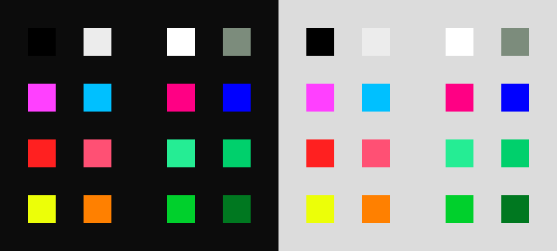

# color-scheme
The Cala Color Scheme - ANSI/GUI Color Palette Designed For Maximum Contrast.

## Motivation
Default colors in GTK applications aren't super easy for me to distinguish (I'm
red-green colorblind).  The built-in alternate themes are even worse, so I made
this.  This may additionally be used as the default theme for applications made
with [cala](https://github.com/libcala/cala).

## Contents (in `scheme.muon`)
 - Easily distiguishable 16-color palette
 - Dark Mode Background
 - Light Mode Background
