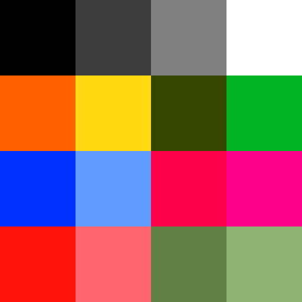

# color-scheme
Color scheme for Aldrotek.

 0. Black (`#000000`)
 1. Dark Gray (`#3D3D3D`)
 2. Light Gray (`#808080`)
 3. White (`#FFFFFF`)
 4. Orange (`#FF6000`)
 5. Yellow (`#FFDA10`)
 6. Brown (`#354600`)
 7. Green (`#00b422`)
 8. Blue (`#0030FF`)
 9. Cyan (`#609CFF`)
 10. Magenta (`#FF0048`)
 11. Fuchsia (`#FF008A`)
 12. Red (`#FF140C`)
 13. Pink (`#FF656F`)
 14. Tan (`#618045`)
 15. Beige (`#8FB372`)
